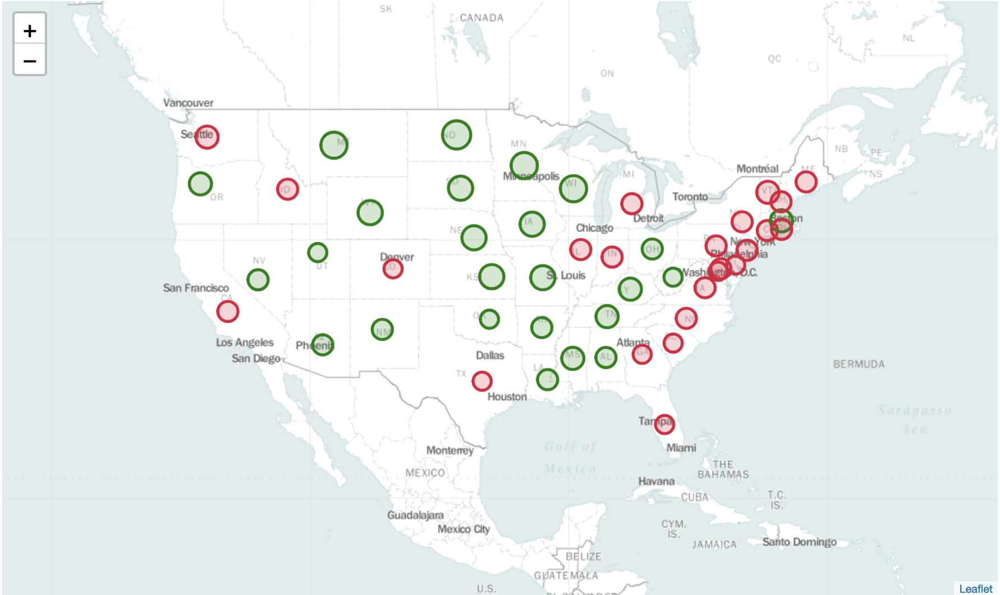
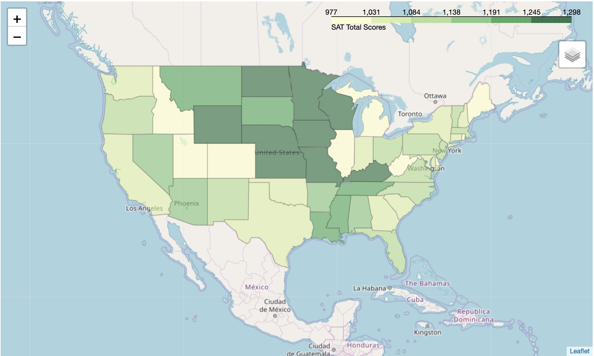

# SAT & ACT Data: Analyzing test scores and participation rates from 2017-18

## Problem Statement
The SAT is the most taken college admission test1, with 2,136,539 students2 from the class of 2018 taking the test. Out of 3,651,200 total students in the class of 2018 in the US3, that's 59% of graduating seniors who took the SAT. Does the SAT need to focus on increasing its participation rates? Or, given that over a majority of high school students are now taking this test as a way to get into college, how are they performing? Is the rise in SAT test-takers contributing to the rise of students going to college?  

**Citations**:
 
1 https://www.collegeboard.org/releases/2018/more-than-2-million-students-in-class-of-2018-took-sat-highest-ever
 
2 https://www.edweek.org/ew/articles/2018/10/31/sat-scores-rise-as-number-of-test-takers.html
 
3 https://nces.ed.gov/programs/digest/d17/tables/dt17_219.10.asp

---
## Executive Summary
**INTRODUCTION**

To conduct an analysis on the SAT, datasets from both the SAT and ACT were used. Each dataset contains state-by-state average test scores and participation rates, specifically from 2017 and 2018. Analyzing test scores and participation rates between the SAT and ACT allowed for a point of comparison to measure the SAT against. Every year, both the SAT and ACT make their test scores and participation data available to the public. 

**METHODOLOGY**

A **data science workflow** was implemented to conduct this analysis. Firstly, the **problem statement** was defined—the College Board needed to determine how to increase participation rates of the SAT. Next, **data scraping** was performed by locating credible sources that housed the appropriate datasets: ACT and SAT test scores and participation rates from 2017-18. Before beginning any analysis of the data, each individual dataset was imported to a **Pandas DataFrame**. Next, **data cleaning** was conducted to ensure that all datatypes were accurate and any other errors were fixed. All datasets were merged into a singular DataFrame. Using all data from both sets and both years, an **exploratory data analysis** was conducted to determine any parameters about the population being measured. Since the ACT and SAT datasets contain data from an entire population of high school students from the class of 2017 and 2018, the population parameters were measured, not sample statistics. All statistical findings were used to then perform **data visualization**. The following data visualizations were used to display the data: 
- heat map
- subplots
- histograms
- scatterplots 
- boxplots 
- bubble graphs
- interactive maps 
- choropleth map

Once all data was visualized and all statistical summaries were conveyed, **descriptive and inferential statistical analysis** was conducted to describe what the distributions were and any trends appeared in the data.  To confirm and support the observations made, **external research** about the SAT and any other relevant data was conducted. Finally, well-informed **data-driven recommendations** for the College Board were compiled. 

**SIGNIFICANT FINDINGS**

When analyzing the datasets, many findings about SAT and ACT test scores and participation rates were gathered. Here are the most significant findings, focusing primarily on the SAT: 
- SAT Total Scores, 2017-18: The distribution of average test scores from all states was bimodal. Students either performed very poorly or very well. 
- SAT Participation Rates, 2017-18: The distribution of participation rates from all states appeared to be right skewed and slightly bimodal, where a majority of states experienced low participation rates, and only some had high participation rates. 
- SAT Test Scores vs Participation Rates, 2017-18: In both years, there was a strong negative correlation between test scores and participation rates. The higher the participation rate, the lower the test score. A concentration of states on the East Coast tended have a combination of high participation and low test scores. 

### ACT-SAT-Data-Recommendations.ipynb Contents:
- Description of the 2017 ACT and SAT data columns
- 2017 Data Import & Cleaning
- 2018 Data Import and Cleaning
- Exploratory Data Analysis
- Data Visualization
- Descriptive and Inferential Statistics
- External Research
- Conclusions and Recommendations
---
## Data Dictionary
|Feature|Type|Dataset|Description|
|---|---|---|---|
|**state**|*object*|final_csv|Names of all US states and the District of Columbia| 
|**sat_ewb_17**|*int*|final_csv|The mean score of the Evidence-Based Reading and Writing (ERW) category of the SAT in 2017 (score range: 200-800)|
|**sat_math_17**|*int*|final_csv|The mean score of the Math category of the SAT in 2017 (score range: 200-800)|
|**sat_total_17**|*int*|final_csv|The sum of the mean scores of ERW and Math in the SAT in 2017 (score range: 400-1600)|
|**sat_participation_17**|*float*|final_csv|The percentage of 2018 graduating seniors who took the SAT (0.9810 means 98.1%)|
|**sat_ewb_18**|*int*|final_csv|The mean score of the Evidence-Based Reading and Writing (ERW) category of the SAT in 2018 (score range: 200-800)|
|**sat_math_18**|*int*|final_csv|The mean score of the Math category of the SAT in 2018 (score range: 200-800)|
|**sat_total_18**|*int*|final_csv|The sum of the mean scores of ERW and Math in the SAT in 2018 (score range: 400-1600)|
|**sat_participation_18**|*float*|final_csv|The percentage of 2018 graduating seniors who took the SAT (0.9810 means 98.1%)|
|**act_science_17**|*float*|final_csv|The mean score of the Science category of the ACT in 2017 (score range: 1-36)|
|**act_reading_17**|*float*|final_csv|The mean score of the Reading category of the ACT in 2017 (score range: 1-36)|
|**act_math_17**|*float*|final_csv|The mean score of the Math category of the ACT in 2017 (score range: 1-36)|
|**act_english_17**|*float*|final_csv|The mean score of the English category of the ACT in 2017 (score range: 1-36)|
|**act_composite_17**|*float*|final_csv|The mean score of the categories English, Math, Reading, and Science on the ACT in 2017 (score range: 1-36)|
|**act_participation_17**|*float*|final_csv|The percentage of 2017 graduating seniors who took the ACT (0.9810 means 98.1%)|
|**act_composite_18**|*float*|final_csv|The mean score of the categories English, Math, Reading, and Science on the ACT in 2018 (score range: 1-36)|
|**act_participation_18**|*float*|final_csv|The percentage of 2018 graduating seniors who took the ACT (0.9810 means 98.1%)|

---
## External Research
In 2018, 2.1 million students from the class of 2018 took the SAT -- the highest ever.1 In fact, there was a 27% increase in participation rates from the previous year.2 SAT participation rates are so high that as of 2018, the test holds the title for "most widely used college admission test," beating the ACT where 1.91 million students took that test in the same year.3 While the SAT can boast of this achievement, the data shows that there is a negative correlation between participation rates and test scores. That is, the higher the participation rate amongst all states and DC, the lower the average student test scores. This is alarming considering that high SAT scores are demanded by most universities and colleges. Contrary to the College Board's claim that the SAT offers "greater access and opportunity" for students who take their test, the more widely their test is offered, the higher the chances are of more students performing poorly. One notable example is Washington, DC, where students had among the highest participation rates of all states in 2017 - 2018, but earned the lowest test scores. Conversely, Minnesota had participation rates in the bottom 10 on a national scale in 2017-18, but earned the highest test scores. Taking a closer look at test scores, students were either performed very poorly or very well. But there were more students who performed poorly than well. If taking the SAT is a significant contributor to college acceptance, the SAT itself is posing a burden to students' access to college. Instead of focusing on increasing participation rates, the SAT show focus more test prep materials.  

**Citations**:
 
1 https://www.collegeboard.org/releases/2018/more-than-2-million-students-in-class-of-2018-took-sat-highest-ever
 
2 https://www.edweek.org/ew/articles/2018/10/31/sat-scores-rise-as-number-of-test-takers.html
 
3 https://www.washingtonpost.com/education/2018/10/23/sat-reclaims-title-most-widely-used-college-admission-test/?utm_term=.c1ca18b8b596

---
## Conclusions & Recommendations 
The College Board focusing on increasing participation rates is equivalent to the College Board assisting in  deterioration of test scores. There is a distinct negative correlation between participation rates and test scores, where the higher the participation rates, the lower the test scores (and vice versa). If the College Board decides to focus solely on increasing participation rates, thereby achieving an ideal of a 100% participation rate, a majority of US high schoolers will perform very poorly on the test. 

This map shows the correlation between SAT test scores and participation rates in 2018. When a state's mean total score is less than the mean total score of the nation (1120) and the participation rate is above 50%, then the bubble is red. When a state's mean total score is above  the mean total score of the nation (1120) and the participation rate is below 50%, then the bubble is green. Bubble sizes correspond to test scores.

This map shows the total SAT scores in 2018 for each state. States in the midwest tend to perform better on the SAT than the rest of the US, however, their participation rates are among the lowest. 

**Recommendations**
In order to achieve sustainable growth and be a resource trusted by students nationwide, I recommend the following:  
- Shift focus away from participation and more towards improving access to test prep resources. 
- Create better test prep material for states with highest participation rates, particularly in the East Coast where there is a concentration of states with high performance and low test scores. 
--- 
## Data Sources
The sources of the datasets used in this analysis: 
- [SAT 2017 dataset](https://blog.collegevine.com/here-are-the-average-sat-scores-by-state/)
- [SAT 2018 dataset](https://reports.collegeboard.org/sat-suite-program-results/state-results)
- [ACT 2017 dataset](https://blog.prepscholar.com/act-scores-by-state-averages-highs-and-lows)
- [ACT 2018 dataset](http://www.act.org/content/dam/act/unsecured/documents/cccr2018/Average-Scores-by-State.pdf)

